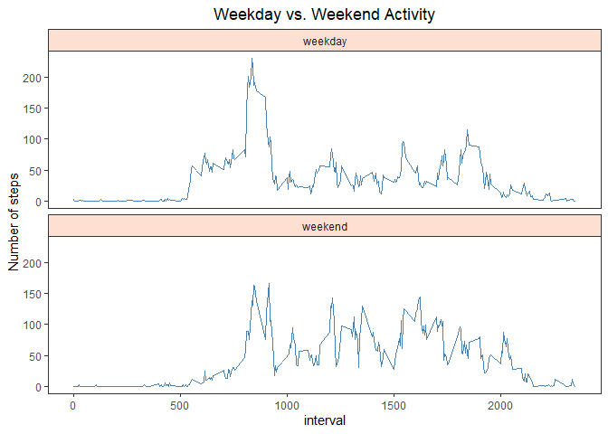

## Libraries, Data Loading & pre-processing.

#### Libraries used as per code block:

```r
library(dplyr)
library(data.table)
library(timeDate)
library(ggplot2)
library(RColorBrewer)

### run on 1st Load only
if(!"data" %in% ls()) {
  unzip(zipfile="activity.zip")
  data <- fread("activity.csv")
}
mutate(data, date=as.Date(date,format='%Y-%m-%d'))
```
#### Date data converted from character to date format.

## What is mean total number of steps taken per day?
**NB:** NA values are ignored. 

```r
### Set up grouped by date data table
step_tot <- data %>%
  group_by(date) %>%
  summarise(tot_steps = sum(steps,na.rm=T))

### Exploratory plot with mean and median total steps
hist(step_tot$tot_steps, xlab="Daily Step Total", ylab="count", ylim=c(0,40), col="cyan", main ="Total Steps per Day")

### Calculate mean & median and add to plot
mean_tot_steps <- round(mean(step_tot$tot_steps, na.rm=T),0)
abline(v=mean_tot_steps, col="blue", lty=1, lwd=2)
text(x=mean_tot_steps, y=39, label=paste("mean", "\n", mean_tot_steps), cex=.8, pos=2, col = 'blue')

median_tot_steps <- median(step_tot$tot_steps, na.rm=T)
abline(v=median_tot_steps, col="red", lty=1, lwd=2)
text(x=median_tot_steps, 39, paste("median", "\n", median_tot_steps), cex=.8, pos=4, col ='red')
```

<!-- -->

#### Mean & Median total number of steps taken per day shown in figure.

## What is the average daily activity pattern?

```r
### Averaging daily steps by interval
step_avg <- data %>%
  group_by(interval) %>%
  summarise(avg_steps = mean(steps, na.rm=T))

### Exploratory plot
plot(y=step_avg$avg_steps,x=step_avg$interval, ylim=c(0,250), main= "Average Daily Activity Pattern",
     type='l', ylab="Daily Step Average", xlab="Interval", col="blue")

### Find Maximum and show in plot
max_avg_steps <- as.integer(max(step_avg$avg_steps,na.rm=T))
max_int <- step_avg$interval[which.max(step_avg$avg_steps)]
points(max_int, max_avg_steps,pch=19)
text(max_int, max_avg_steps, paste('Max.avg.steps at interval ',max_int,'\n =',max_avg_steps),cex=0.8,col='blue',pos=4)
```

<!-- -->

#### Interval 835, on average across all the days in the dataset, contains the maximum number of steps = 206 as shown in figure.

## Imputing missing values

```r
### check for missing (NA)
missing <- data %>% count(missing = is.na(steps))
print (paste("Missing Value Count = ", missing$n[which(missing$missing==TRUE)]))
```

```
## [1] "Missing Value Count =  2304"
```

Missing values are replaced with the daily mean of the 5 min. intervals.  


```r
### Replace NA with mean value for interval

data_fill <- data
step_avg <- as.data.table(step_avg)
data_fill[is.na(steps), steps := round(step_avg[.SD, avg_steps, on='interval'],0)]

### set up grouped by date data
step_tot_fill <- data_fill %>%
  group_by(date) %>%
  summarise(tot_steps = sum(steps,na.rm=T))

### Exploratory plot with mean and median total steps
hist(step_tot_fill$tot_steps, xlab="Daily Step Total", ylab="count", ylim=c(0,40), col="cyan",
     main ="Total Steps per Day (NA filled)")

### Calculate mean & median and add to plot
mean_tot_steps_fill <- round(mean(step_tot_fill$tot_steps, na.rm=T),0)
abline(v=mean_tot_steps_fill, col="blue", lty=1, lwd=2)
text(x=mean_tot_steps_fill, y=39, label=paste("mean", "\n", mean_tot_steps_fill), cex=.8, pos=2, col = 'blue')

median_tot_steps_fill <- median(step_tot_fill$tot_steps, na.rm=T)
abline(v=median_tot_steps_fill, col="red", lty=1, lwd=2)
text(x=median_tot_steps_fill, 39, paste("median", "\n", median_tot_steps_fill), cex=.8, pos=4, col ='red')
```

<!-- -->

#### The **mean** and **median** values from the missing value adjusted dataset differs from the estimates from the first part of the assignment.  
#### The impact of imputing missing data seems to adjust the distribution of steps more towards a normal distribution bringing the mean and median much closer together.  

## Are there differences in activity patterns between weekdays and weekends?

```r
### create factor for weekday
data_fill <- data_fill %>% mutate(weekday = as.factor(isWeekday(date)))

### Averaging daily steps by interval and weekday, converting logical to label
step_avg_week <- data_fill %>%
  group_by(interval, weekday)%>%
  summarise(avg_steps = mean(steps, na.rm=T))

### Converting logical to label factor
step_avg_week$weekday <- as.character(step_avg_week$weekday) 
step_avg_week$weekday[step_avg_week$weekday==TRUE] <- "weekday"
step_avg_week$weekday[step_avg_week$weekday==FALSE] <- "weekend"

### Panel plots weekend / weekday

chart <- ggplot(step_avg_week, aes(x=interval, y= avg_steps))
chart <- chart + geom_line(col='steelblue')
chart <- chart + facet_wrap(~ weekday, ncol = 1)
chart <- chart + labs(title = "Weekday vs. Weekend Activity", y="Number of steps")
chart <- chart + theme_bw()
chart <- chart + theme(plot.title = element_text(hjust = 0.5))
chart <- chart + theme(panel.grid.major=element_blank(), panel.grid.minor=element_blank(),
                       strip.background =element_rect(fill=brewer.pal(n = 3, name = "Reds")))
print(chart)
```

<!-- -->

#### Using the filled-in missing values dataset, the Weekday vs. Weekend Activty comparison above shows:-  
#### * a similar pattern of activity starting slightly later on weekends.  
#### * a higher peak step count around the 800 interval on weekdays.  
#### * slightly higher activity between intervals 1000 to 2000 on weekends.  
 
